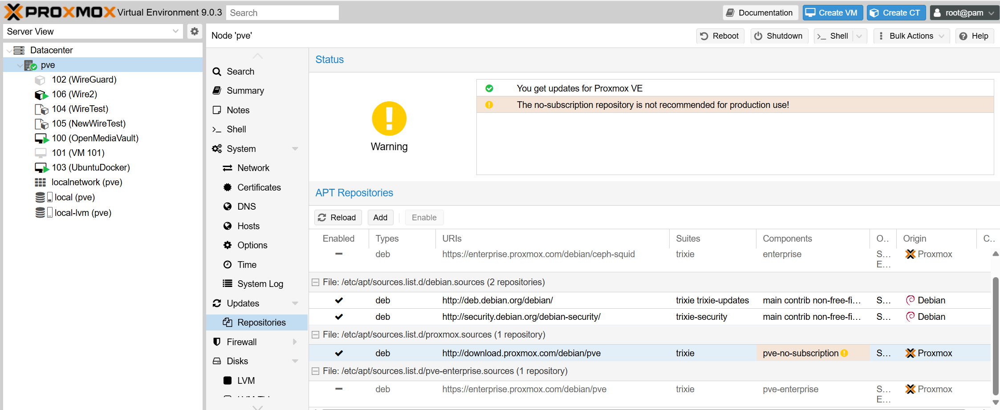
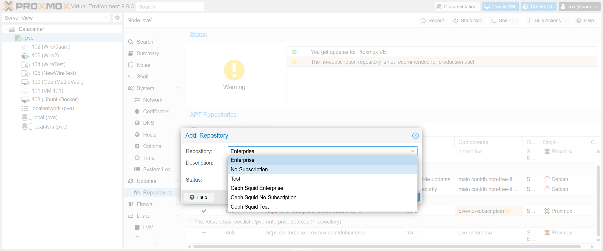

# How to allow Promox to use non-subscription repository to get updates

For latest Information on this topic [click here.](https://pve.proxmox.com/wiki/Package_Repositories)

You Could use either the Promox GUI or the CLI to enact this change

# GUI
1. Click on the node you want to edit
2. Go to updates and then repositories
3. Click add

4. Select the non-subscription option from the dropdown menu

5. Click add

# CLI
Copy and paste the following into ```/etc/apt/sources.list.d/proxmox.sources```

```
Types: deb
URIs: http://download.proxmox.com/debian/pve
Suites: trixie
Components: pve-no-subscription
Signed-By: /usr/share/keyrings/proxmox-archive-keyring.gpg
```